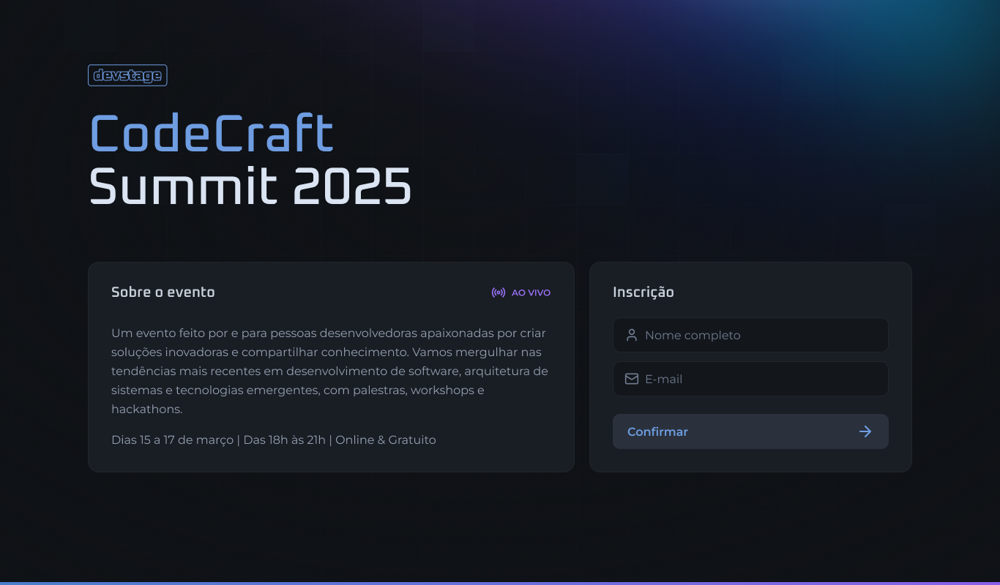
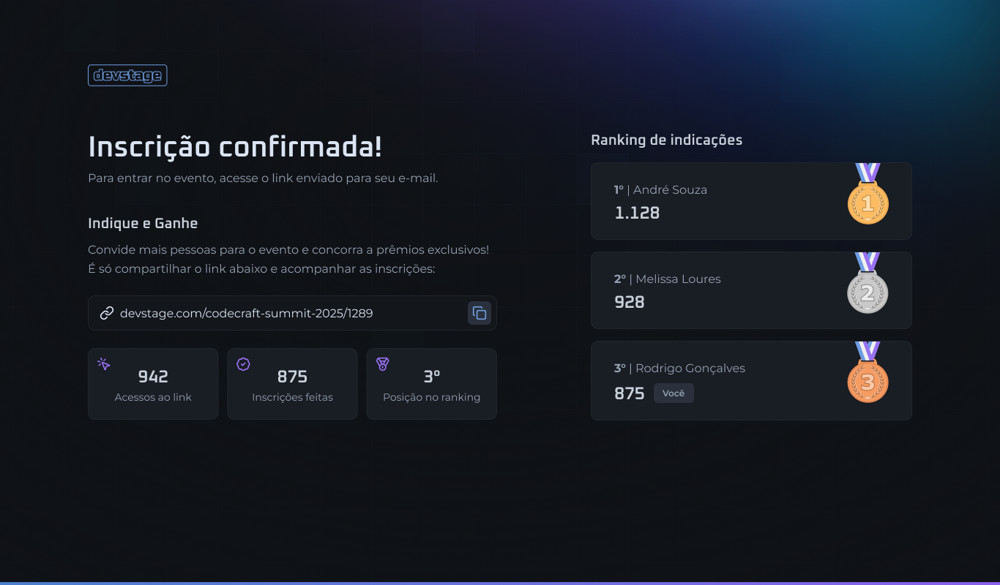

# DevStage

## Ferramenta Front 

- Aplicação usando React 
- Usando Nextjs
- Zod
- Tailwind-merge
- Tailwindcss
- Orval
- React Hook Form

 

## Rodar o projeto 

- primeiro instalar o nodejs versão LTS
- npm install para instalar todas as dependência
- npm run dev para executar o projeto 
  
